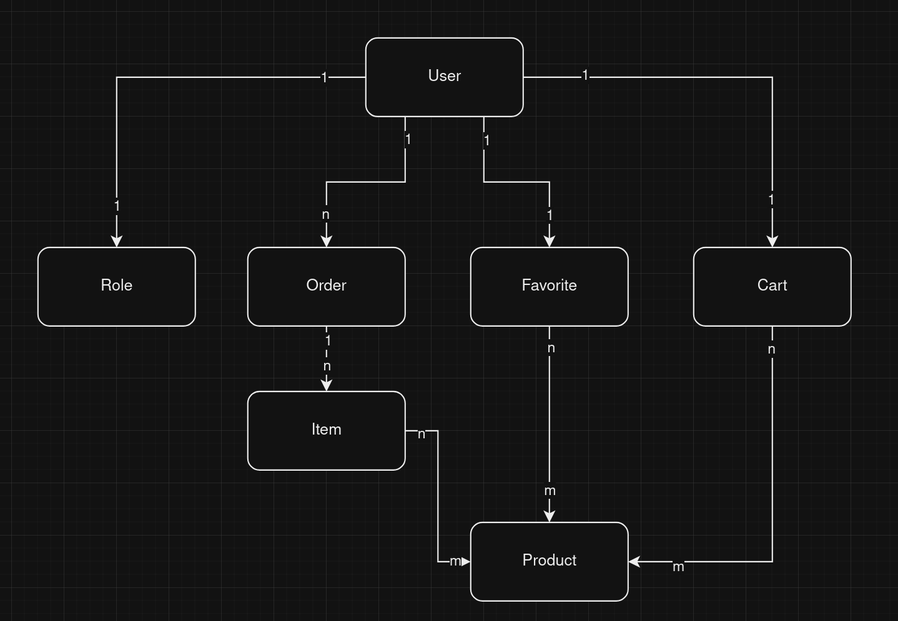
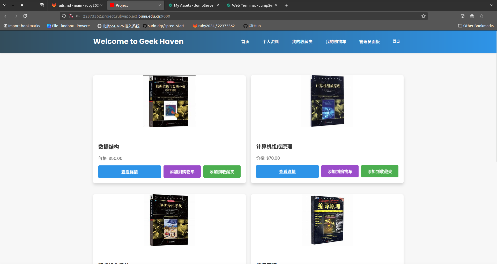
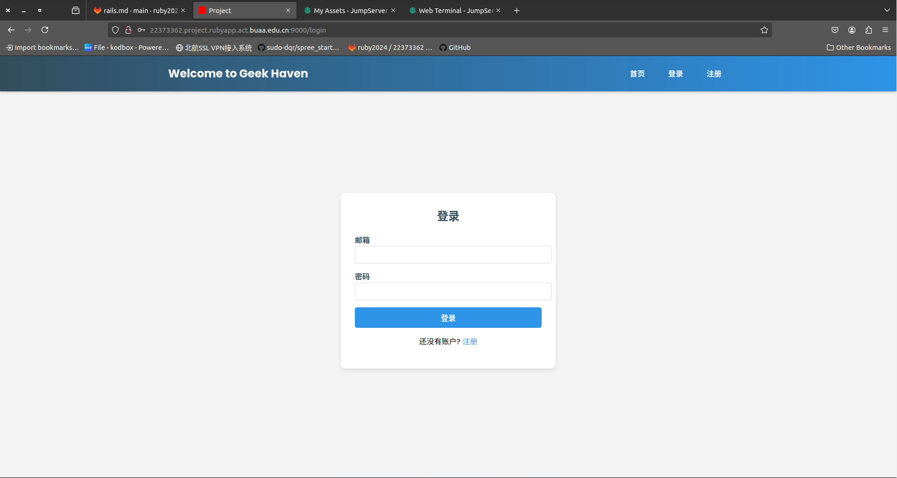
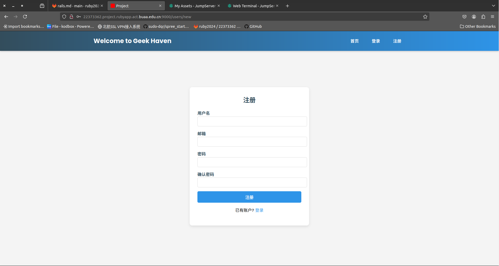
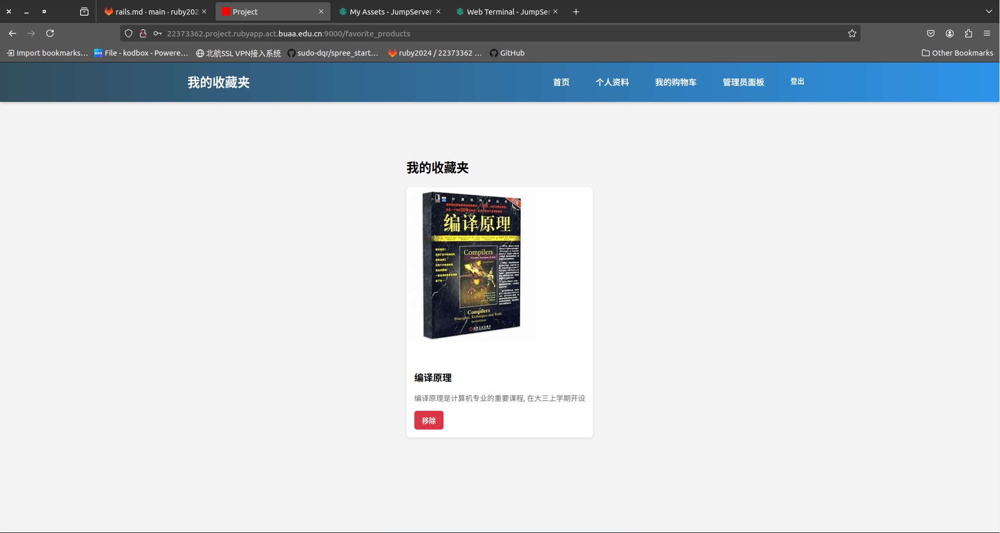
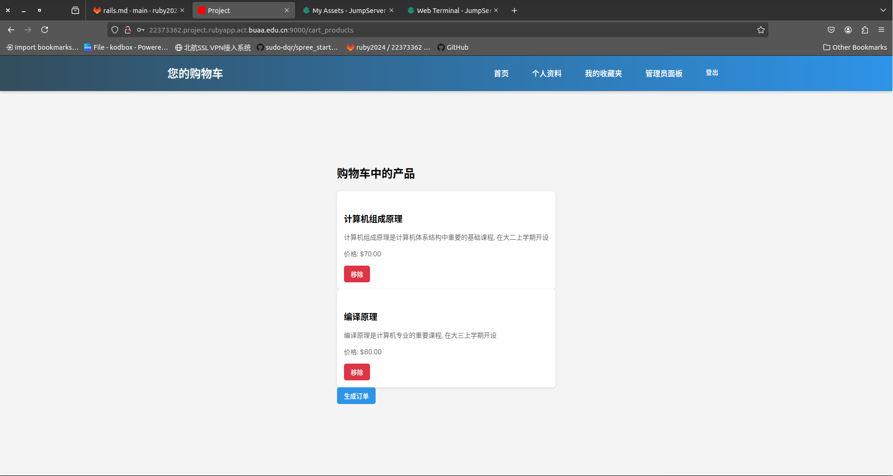
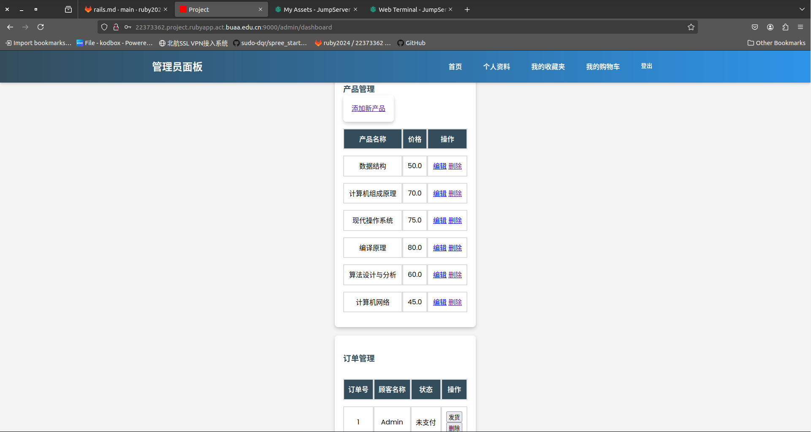
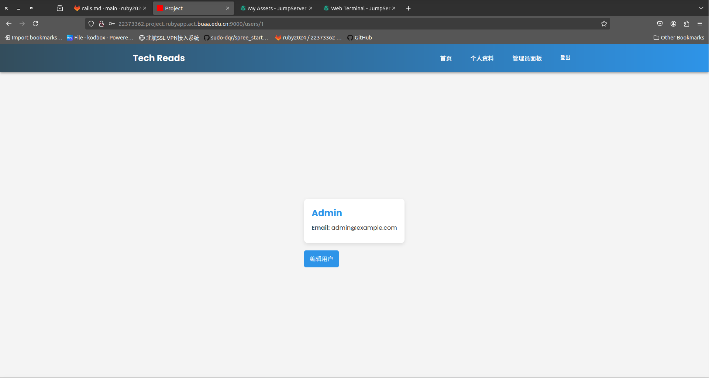
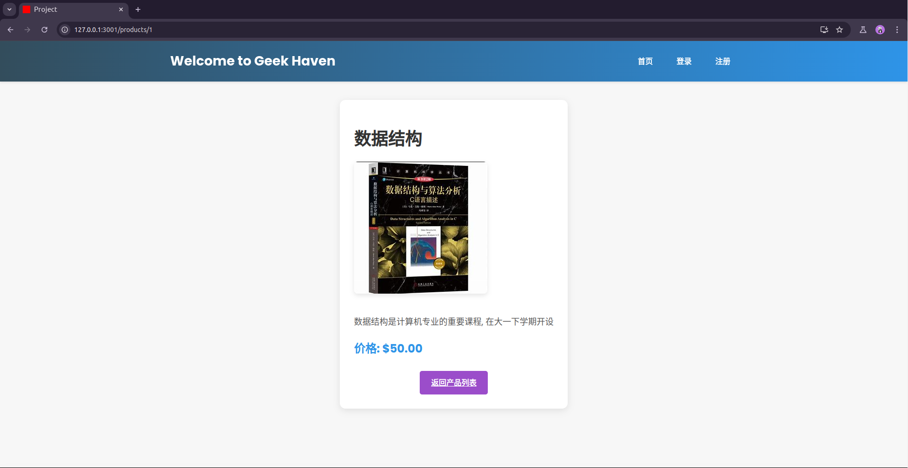

# 
E-Commerce电子商城设计文档

——杜启嵘22373362

## 0. 开发环境

* Ruby 3.3.4
* Rails 7.2.1
* bundle 2.5.22
* Ubuntu 22.04

## 1. 数据库设计

> 本部分设计主要参考课程要求中的要求实现.

### 1.1 数据模型设计

#### 1.1 User

> 用户表

| 属性     | 解释           | 数据类型 |
| -------- | -------------- | -------- |
| id       | 用户id         | bigint   |
| name     | 用户名字       | string   |
| email    | 用户邮箱       | string   |
| password | 用户密码       | string   |
| role_id  | 用户所属角色id | bigint   |

#### 1.2 Role

> 角色表(普通用户/管理员)

| 属性 | 解释     | 数据类型 |
| ---- | -------- | -------- |
| id   | 角色id   | bigint   |
| name | 角色名称 | string   |

#### 1.3 Product

> 产品表

| 属性        | 解释     | 数据类型 |
| ----------- | -------- | -------- |
| id          | 商品id   | bigint   |
| name        | 商品名称 | string   |
| description | 商品描述 | text     |
| price       | 商品价格 | decimal  |
| sales       | 销量     | integer  |
| ...         |          |          |

#### 1.4 Order

> 订单表

| 属性         | 解释       | 数据类型 |
| ------------ | ---------- | -------- |
| total        | 订单总金额 | decimal  |
| state        | 订单状态   | integer  |
| user_id      | 所属用户id | bigint   |
| completed_at | 完成时间   | datetime |

#### 1.5 Item

> 订单项表

| 属性     | 解释             | 数据类型 |
| -------- | ---------------- | -------- |
| order_id | 关联到订单表的id | bigint   |
| price    | 订单项价格       | decimal  |
| quantity | 订单项数量       | integer  |

#### 1.6 Favorite

> 收藏夹表

| 属性     | 解释     | 数据类型 |
| -------- | -------- | -------- |
| user_id  | 用户id   | bigint   |
| added_at | 添加时间 | datetime |

#### 1.7 Cart

> 购物车表

| 属性     | 解释     | 数据类型 |
| -------- | -------- | -------- |
| user_id  | 用户id   | bigint   |
| quantity | 产品数量 | integer  |
| added_at | 添加时间 | datetime |

### 1.2 模型关系设计与E-R图

​	数据实体之间的关联通常有一对一、一对多、多对多三种模式：

* 一对一模式中：采用`belongs_to`，`has_one`以及外键实现.
  * User->Role, User->Cart, User->Favorite
* 一对多模式中：采用`belongs_to`，`has_many`以及外键实现.
  * User->Order
* 多对多模式中：采用`has_many:through`的方法，提供了更好的灵活性.
  * Item->Product, Favorite->Product, Cart->Product
  * 通过设计中间表ProductItem,ProductFavorite,ProductCart完成，每个表中保存两个外键和added_time

## 2. 系统功能设计

### 2.1 管理员功能

* 添加/编辑/查看/删除产品
* 查看所有订单列表
* 处理订单(发货/删除)

### 2.2 普通用户功能

* 浏览产品列表/查看单品详情
* 添加到购物车
* 购物车内容生成订单
* 查看自己的订单列表
* 订单操作：付款/确认到货/取消订单
* 添加/删除产品到收藏夹
* 浏览收藏夹

## 3. 部署运行

> 首先需要满足开发环境需求

1. `cd project`
2. `bundle install`
3. `bin/rails db:migrate`
4. `bin/rails db:seed`
5. `bin/rails serve`：默认在3000端口上运行

​	默认通过注册页面只能注册普通用户，管理员用户在seed.rb中生成，帐号为admin@example.com，密码password.

## 4. 功能及页面展示

### 1. 网站首页

> 展示页面为使用默认的管理员账户登陆后的页面

### 2. 用户登陆页面

### 3. 用户注册页面

> 默认只能注册普通用户

### 4. 用户收藏夹页面

### 5. 用户购物车页面

### 6. 管理员管理面板页面

### 7. 用户主页

### 8. 商品详情

